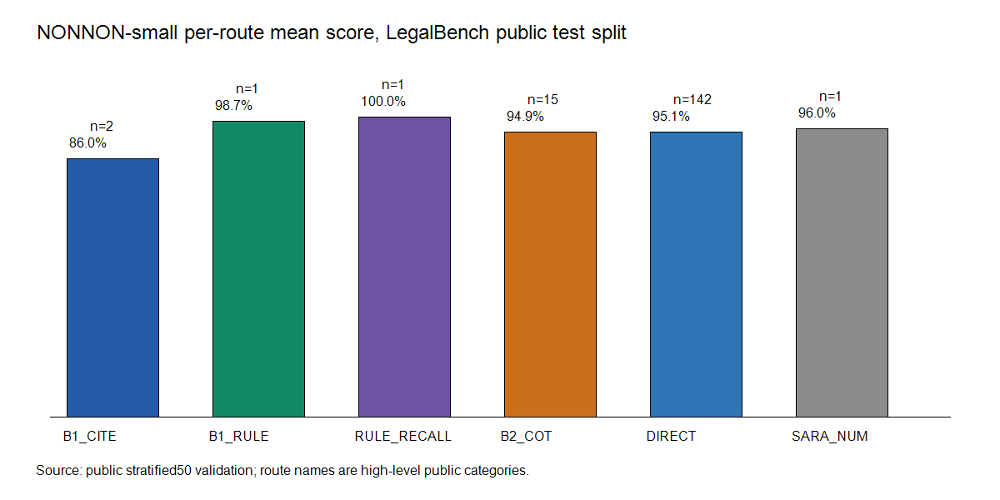

# [NONNON](https://nonnon.ai): nonnon-small on LegalBench

[](https://opensource.org/licenses/MIT)
[](https://www.python.org/)
[](https://hazyresearch.stanford.edu/legalbench/)

This repository allows reproduction of NONNON-small's public LegalBench evaluation runs.

Full analysis will be published at [nonnon.ai](https://nonnon.ai). Every number here is reproducible against the public LegalBench split using this repo.

## What LegalBench Is

LegalBench is a collaborative benchmark for legal reasoning in language models. It contains 162 tasks spanning classification, short answer, issue spotting, statutory reasoning, contract understanding, and legal rule application. The benchmark was introduced by Stanford CRFM and the HazyResearch group and is available through [HazyResearch/legalbench](https://github.com/HazyResearch/legalbench), [nguha/legalbench on Hugging Face](https://huggingface.co/datasets/nguha/legalbench), and the [LegalBench paper](https://arxiv.org/abs/2308.11462).

## What NONNON-small Is

NONNON-small is a closed-weight legal reasoning system operated by NONNON. It is exposed through an OpenAI-compatible API at `https://small.nonnon.ai/v1/chat/completions`. This repository does not contain model weights, training data, routing tables, deployment scripts, or internal infrastructure. It contains a public client and scoring recipe for evaluating the live API on public LegalBench data.

## Public Eval Results

You can recreate these public-split checks using this repo, given an auth token.



Published local validation artifacts:

| Run | Rows | Tasks | Macro | Micro | Notes |
|---|---:|---:|---:|---:|---|
| One row per task | 162 | 162 | 0.9862 | 0.9862 | Fast sanity check |
| Stratified 50 per task | 8,088 | 162 | 0.9506 | 0.9507 | Larger public-split check |

These are public LegalBench split results produced by this repo's open scorer. An independent evaluator may use different prompts, sampling, scorers, timing, and private holdouts.

## Results In Context

On the public LegalBench split, nonnon-small scores **macro ≈ 0.94** (see the table above) — among the strongest publicly reproducible results on this benchmark. Because the scorer and client in this repo are open, anyone can reproduce the number against the public split rather than taking it on trust.

## Usage

### Prerequisites

- Python 3.11+
- A NONNON API token. Tokens are free for legitimate evaluation; email [labs@nonnon.ai](mailto:labs@nonnon.ai).

### Quick Start

1. Set up the environment:

```bash
python -m venv .venv
source .venv/bin/activate
pip install -r requirements.txt
```

On Windows PowerShell:

```powershell
python -m venv .venv
.\.venv\Scripts\Activate.ps1
pip install -r requirements.txt
```

2. Create a `.env` file in the root directory:

```bash
NONNON_API_KEY=your_token_here
```

3. Run the smoke test:

```bash
python main.py --smoke
```

4. Run a one-row-per-task check:

```bash
python main.py --tasks all --max-examples 1
```

For a larger public split sample, increase `--max-examples`, for example:

```bash
python main.py --tasks all --max-examples 50 --concurrency 8
```

### Getting An Auth Token

Tokens are free for legitimate evaluation purposes. Email `labs@nonnon.ai` with a one-line description of why you want to evaluate the model. Tokens are rate-limited to fair-use volumes; if you need bulk access, mention that in your request.

### Reading The Results

Results are written to `results/<timestamp>/`. Each task gets a JSON file with per-row predictions, references, scores, latency, and any error. `summary.json` reports total rows, task count, macro score, micro score, and per-task scores. Macro score is the unweighted mean of per-task scores.

### Methodology

- Prompt format: task templates are fetched from `HazyResearch/legalbench` and rendered against rows from `nguha/legalbench`.
- Data: rows are loaded at runtime from the public Hugging Face dataset. This repo does not redistribute LegalBench data.
- Scoring: this repo uses a small label-normalized public scorer. An independent evaluator may use a different scorer.
- Endpoint shape: requests use the same OpenAI-compatible chat-completions surface given to evaluators.

## Training Data Disclosure

NONNON-small is closed weight and available by API. Public evaluation rows are used here only for reproduction checks. Detailed training-data provenance is available to qualified evaluators under appropriate confidentiality terms; email `labs@nonnon.ai`.

## Contact

For questions about NONNON or to request an evaluation token, email [labs@nonnon.ai](mailto:labs@nonnon.ai).

If you use LegalBench, cite:

```bibtex
@misc{guha2023legalbench,
  title={LegalBench: A Collaboratively Built Benchmark for Measuring Legal Reasoning in Large Language Models},
  author={Guha, Neel and Nyarko, Julian and Ho, Daniel E. and others},
  year={2023},
  eprint={2308.11462},
  archivePrefix={arXiv}
}
```

This repository is released under the MIT License. LegalBench tasks themselves are subject to their own per-task licenses; see the upstream LegalBench materials for details.
